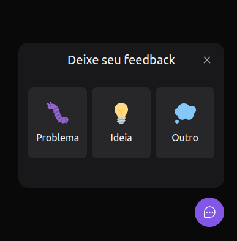

# FeedGet Web (Feedback Widget - Desktop)



## Description

Widget for sending feedbacks. Project developed with React JS for front-end, Prisma for back-end, and Mailtrap.oi to test the email sending. Tailwind CSS for styling, Headless UI for accessibility, and Jest for unitary tests. Vercel and Railway for front- and back-end deployment, resepctively.

**Versions:** desktop and mobile.

## Technologies

- [ ] React Js [link](https://reactjs.org/)
- [ ] Tailwind CSS [link](https://tailwindcss.com/)
- [ ] Headless UI [link](https://headlessui.dev/)
- [ ] Prisma [link](https://www.prisma.io/)
- [ ] Jest [link](https://jestjs.io/)
- [ ] Mailtrap.io [link](https://mailtrap.io/)
- [ ] SWC [link](https://swc.rs/)

## Getting started

Use **yarn** or **npm install** to install the dependencies and then start the project:

```cl
expo start
```
